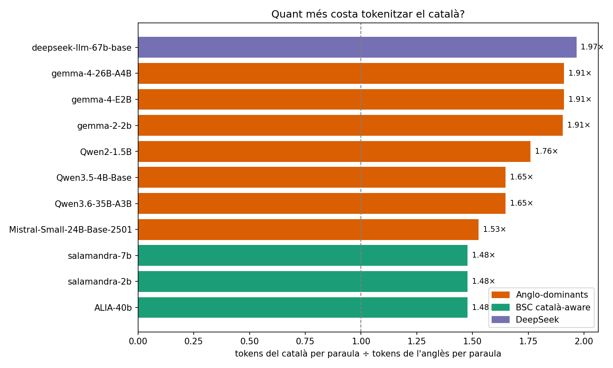
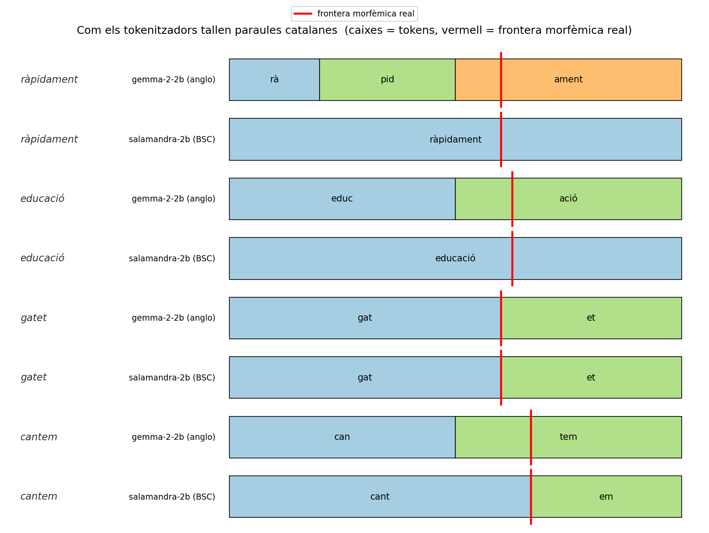
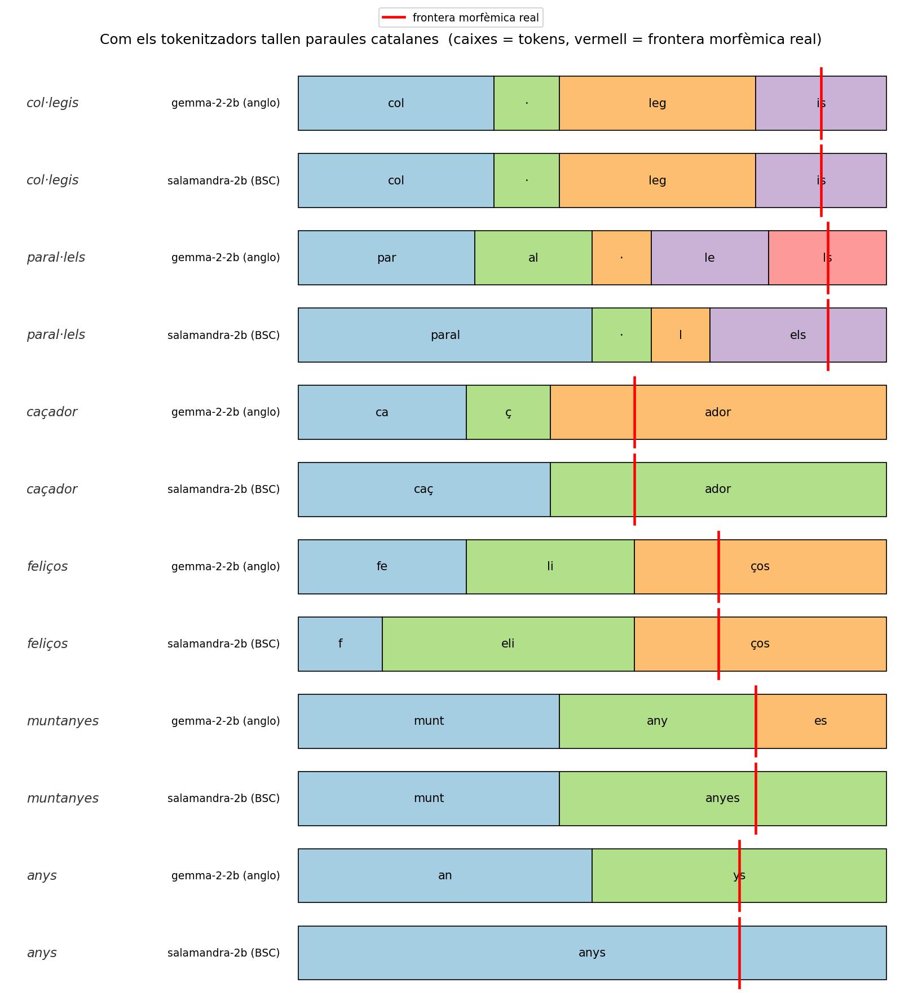
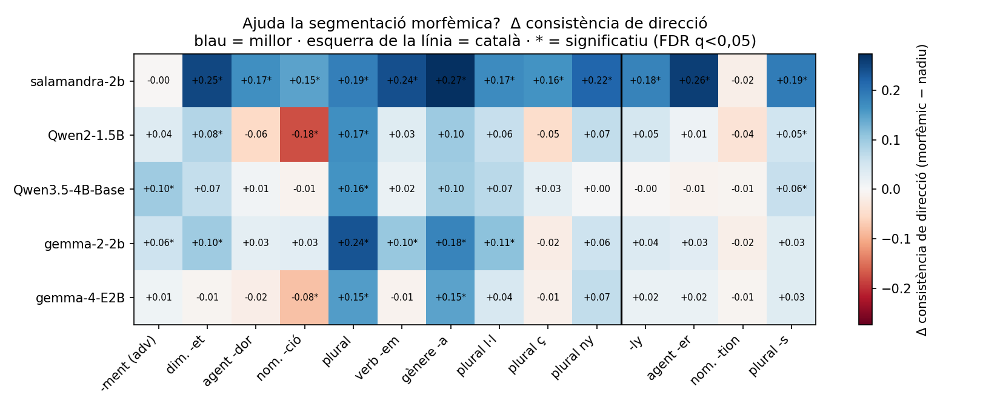
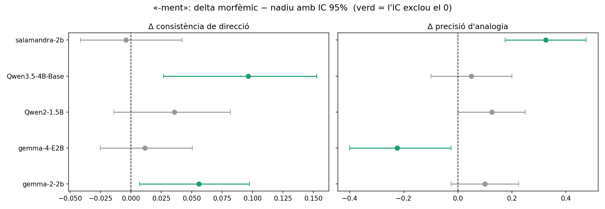
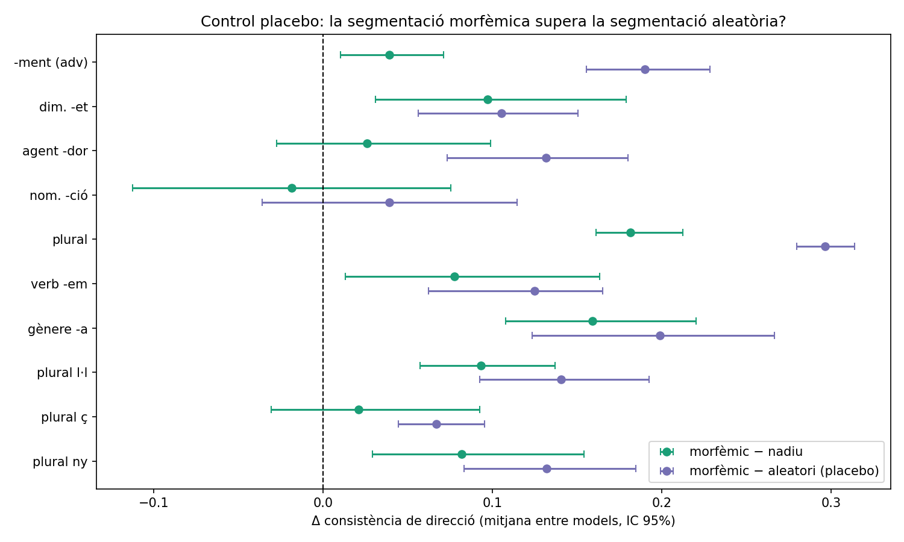
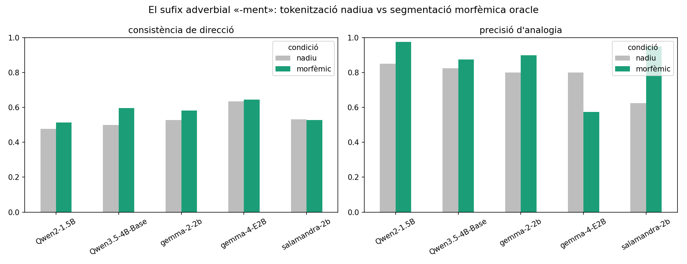

# La morfologia no surt de franc

**Com la tokenització en subparaules fractura la morfologia catalana, i si
una segmentació universal recupera la geometria de l'espai latent.**

Estudi germà de [*Coca Is Not Cocaine*](https://github.com/xaviviro/coca-is-not-cocaine), que reutilitza el mateix panell de
models de pesos oberts però fa una pregunta de tokenització i morfologia:
no *on cau una paraula*, sinó *com el tokenitzador la talla* i què li fa
això a la **geometria composicional** de la morfologia catalana — amb el
sufix adverbial **`-ment`** (`ràpid → ràpida → ràpidament`) com a cas
protagonista.

---

## Resum

Hem mesurat com els tokenitzadors dels grans models de llenguatge tallen la
morfologia catalana, i hem provat si imposar les fronteres morfèmiques
correctes recupera estructura composicional. Quatre resultats:

1. **El català es fragmenta molt més que l'anglès.** Als models
   anglo-dominants (Gemma, Qwen, Mistral) una paraula catalana costa **~1,7×**
   més *tokens* que una d'anglesa (fins a **1,9×** a DeepSeek-67B). Els
   tokenitzadors entrenats amb català del **Barcelona Supercomputing Center**
   (Salamandra / ALIA) **redueixen aquest cost a 1,36×**.

2. **Menys fragmentació no vol dir alineació morfèmica.** Cap tokenitzador
   del panell aïlla bé el sufix `-ment` (només ~20 % de les vegades). El
   tokenitzador del BSC fragmenta menys perquè manté paraules senceres en un
   sol *token* — però això **amaga la frontera del morfema a dins**, no
   l'exposa.

3. **Una segmentació morfèmica oracle recupera geometria composicional.** Si
   forcem el tall pels morfemes en temps d'inferència (sense reentrenar), la
   **geometria millora als cinc models petits** — sobretot en flexió (gènere,
   plural) i en l'analogia de `-ment`. Això suggereix que una tokenització
   "universal" conscient dels morfemes exposaria estructura que els models ja
   codifiquen en part.

4. **El punt volat (`l·l`) és el tret ortogràfic més castigat.** Una paraula
   amb ela geminada (*col·legi*) es parteix en ~4 *tokens* perquè tots dos
   tokenitzadors aïllen el `·` com a token propi; ni tan sols el tokenitzador
   català-aware ho comprimeix. La `ç` i el dígraf `ny` afegeixen un càstig
   menor.

> Els models del BSC (Salamandra / ALIA) s'inclouen com a control
> *català-aware* i es descriuen de manera neutra al llarg de tot l'estudi.

---

## La fragmentació, en una figura



Quants *tokens* més costa el català que l'anglès, per tokenitzador. El
càstig més gran és per a DeepSeek-67B (1,89×) i Gemma (~1,85×); el més baix,
de bon tros, és el tram català-aware del BSC (1,36×).

### Com els tokenitzadors tallen les paraules catalanes



Les caixes són *tokens*; la línia vermella és la frontera real del morfema.
Gemma (anglo) sobre-fragmenta i gairebé mai talla pel morfema (a
*ràpidament* fa `rà|pid|ament`, i la frontera `ràpida|ment` cau *dins* de
l'últim *token*); Salamandra (BSC) manté la paraula sencera però aleshores
amaga la costura morfèmica dins d'un sol *token*. Cap dels dos aïlla
`-ment`. En canvi, tots dos coincideixen a *gatet* (`gat|et`) i Salamandra
encerta *cantem* (`cant|em`).

### Trets ortogràfics catalans: `l·l`, `ç` i `ny`



El **punt volat (`l·l`) és el cas extrem**: tots dos tokenitzadors aïllen el `·`
com a token propi, així que una paraula amb ela geminada costa ~4–4,6
subparaules (gairebé el doble d'un plural normal), i **ni el tokenitzador
català-aware ho comprimeix**. La `ç` i el dígraf `ny` afegeixen un càstig
menor.

### La mitigació: ajuda una segmentació morfèmica?



Blau = la geometria millora quan forcem la segmentació morfèmica oracle
(empalmant *token ids*, sense reentrenar). El delta és positiu a gairebé
totes les famílies catalanes i als cinc models, més fort en la flexió. Un
asterisc marca les cel·les on l'**IC 95 % per bootstrap** exclou el zero.



Amb només ~40 parells per família, els intervals de confiança temperen la
lectura: el guany d'analogia de Salamandra-2B és clarament significatiu
(+0,33), com també la regressió de Gemma-4-E2B (−0,23); moltes altres cel·les
són positives de mitjana però el seu IC creua el zero.

### Rigor: és específic dels morfemes? (control placebo)



Per descartar que *qualsevol* re-segmentació millori la geometria, comparem la
morfèmica amb una segmentació **aleatòria** (mateix nombre de peces, tall no
morfèmic). En els **cinc models** la morfèmica supera l'aleatòria amb IC 95 %
que exclou el zero — i la segmentació aleatòria *empitjora* la geometria per
sota de la nativa. El guany és **específic dels morfemes**, no de trossejar.
Les significacions per cel·la dels mapes de calor estan corregides per
comparacions múltiples (Benjamini–Hochberg FDR).

### El sufix protagonista: `-ment`



Gris = tokenització nadiua, verd = segmentació morfèmica oracle. La
re-segmentació millora la consistència de direcció en 4 de 5 models i
l'analogia en 4 de 5; el guany més espectacular és l'analogia de
Salamandra-2B (0,625 → 0,950).

---

## Què hem fet

- **RQ1 — Auditoria del tokenitzador (els 11 tokenitzadors del panell, sense
  GPU):** fertilitat (subparaules/paraula) català vs anglès, i *recall* de
  frontera morfèmica.
- **RQ2 — Geometria (5 models petits, GPU):** és lineal el subespai
  morfològic? La "direcció `-ment`" `v(adverbi) − v(adjectiu)` com a vector
  consistent, a la manera de Bolukbasi et al. (2016).
- **RQ3 — Mitigació (contrafactual, sense reentrenar):** imposem una
  segmentació morfèmica oracle per empalmament de *token ids* i tornem a
  mesurar la geometria.

## El lèxic

Lèxic curat a mà (`data/morph_pairs.csv`, **319 parells** base→derivat, 11
famílies, llicència CC-BY), revisat per l'autor (accents, la regla del femení
per a `-ment`, formes irregulars):

| llengua | família | n | morfologia |
| --- | --- | -: | --- |
| ca | `ment` | 40 | adjectiu → adverbi, sobre el femení (`ràpid → ràpida → ràpidament`) |
| ca | `dim_et` | 30 | diminutiu `-et/-eta` |
| ca | `agent_dor` | 25 | agentiu `-dor` |
| ca | `nom_cio` | 24 | nominalitzador `-ció` |
| ca | `plural` | 30 | plural `-s/-os` |
| ca | `verb_em` | 25 | 1a pl. present `-em` |
| ca | `gender_a` | 25 | gènere `-a` |
| en | `ly` | 40 | adverbi `-ly` (paral·lel a `-ment`) |
| en | `agent_er` | 25 | agentiu `-er` |
| en | `nom_tion` | 25 | nominalitzador `-tion`/`-ation` |
| en | `plural_s` | 30 | plural `-s` |

## El panell de models

L'auditoria de tokenitzadors cobreix els 11 models de l'estudi *coca*. La
geometria de l'espai vectorial corre sobre el tram petit (cap en una GPU de
16 GB a bf16):

| tram | models |
| --- | --- |
| geometria + auditoria | `gemma-2-2b`, `gemma-4-E2B`, `Qwen2-1.5B`, `Qwen3.5-4B-Base`, **`BSC-LT/salamandra-2b`** |
| només auditoria | `gemma-4-26B-A4B`, `Mistral-Small-24B`, `Qwen3.6-35B-A3B`, `deepseek-llm-67b-base`, `BSC-LT/salamandra-7b`, `BSC-LT/ALIA-40b` |

`salamandra-2b` és el control català-aware: un model amb un tokenitzador
entrenat amb una proporció no trivial de català.

## Documentació

| vols… | llegeix |
| --- | --- |
| el mètode (RQ, mecanisme d'empalmament, mètriques) | [`docs/methodology.md`](docs/methodology.md) |
| els resultats + xifres | [`docs/findings.md`](docs/findings.md) |
| què **no** afirma l'estudi | [`docs/limitations.md`](docs/limitations.md) |
| com regenerar-ho tot | [`docs/reproduce.md`](docs/reproduce.md) |
| treball relacionat i referències | [`docs/references.md`](docs/references.md) |

> Tota la documentació (README, `docs/`) i el text dels gràfics són en català.

## Inici ràpid

```bash
uv sync
uv run pytest -q
uv run python scripts/m01_build_lexicon.py
uv run python scripts/m02_tokenize_audit.py
for M in google/gemma-2-2b google/gemma-4-E2B Qwen/Qwen2-1.5B Qwen/Qwen3.5-4B-Base BSC-LT/salamandra-2b; do
  uv run python scripts/m03_extract.py --model "$M"
done
uv run python scripts/m04_geometry.py
uv run python scripts/m05_figs.py
uv run python scripts/m06_figs.py
```

## Llicència

Codi: MIT. El lèxic curat a mà (`data/morph_pairs.csv`) és CC-BY 4.0 —
citeu-lo si el reutilitzeu.

## Autor

Xavier Vinaixa Roselló — Sorensen AI ([sorensen.ai](https://sorensen.ai)),
Barcelona · [ORCID 0009-0005-2769-9215](https://orcid.org/0009-0005-2769-9215)
· [github.com/xaviviro](https://github.com/xaviviro) ·
[xavi@sorensen.ai](mailto:xavi@sorensen.ai)

## Citació

```bibtex
@misc{vinaixa2026morfologia,
  title        = {La morfologia no surt de franc: com la tokenitzaci\'o en
                  subparaules fractura la morfologia catalana},
  author       = {Vinaixa Rosell\'o, Xavier},
  year         = {2026},
  institution  = {Sorensen AI, Barcelona},
  note         = {ORCID: 0009-0005-2769-9215},
  url          = {https://github.com/xaviviro/la-morfologia-no-surt-de-franc}
}
```

Hi ha un `CITATION.cff` a l'arrel del repositori perquè les eines que
consumeixen el Citation File Format el llegeixin directament (GitHub en
genera un botó «Cite this repository»).
