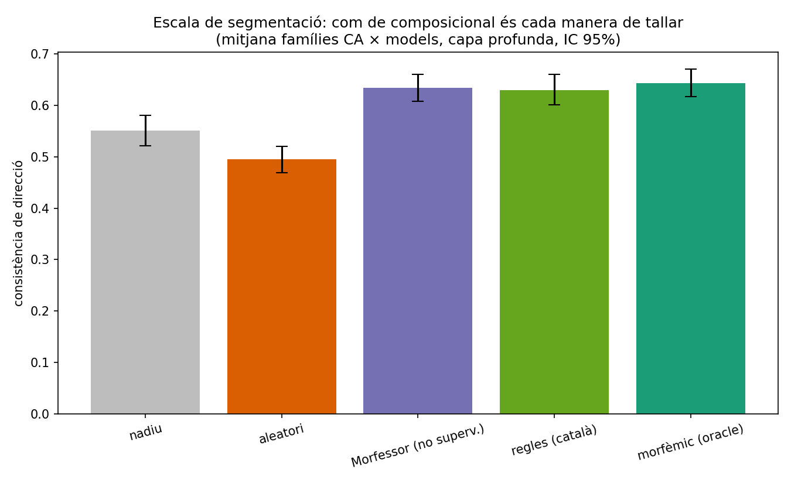
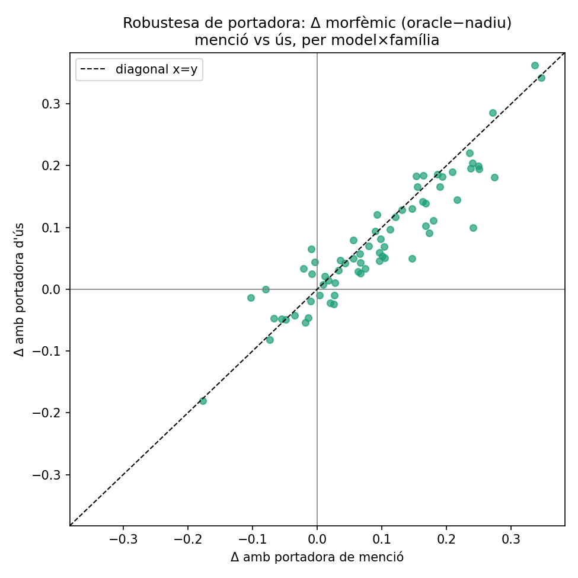
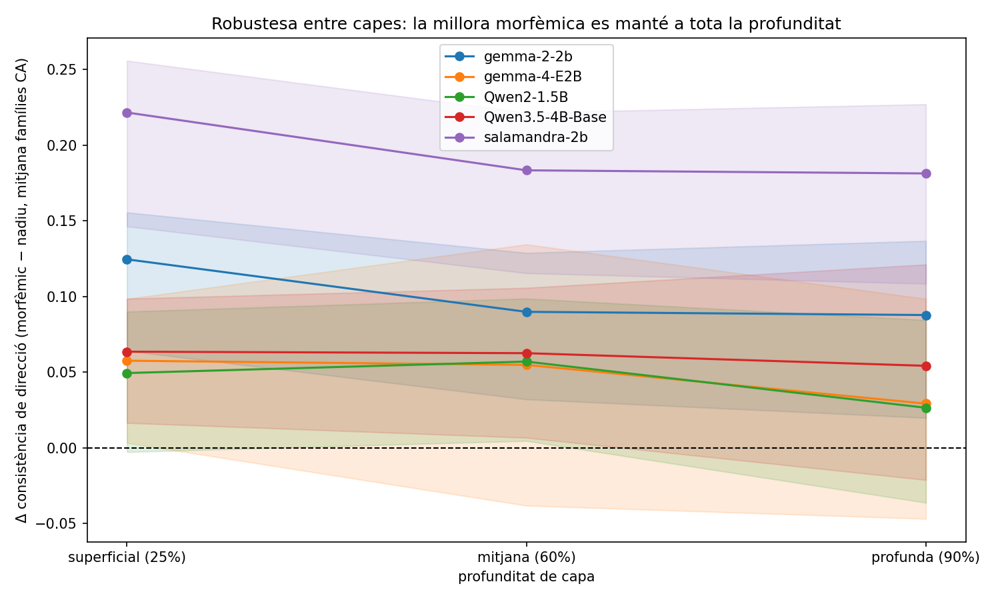
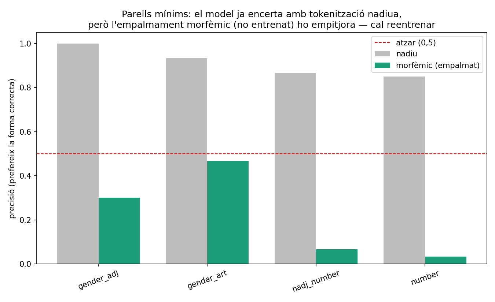
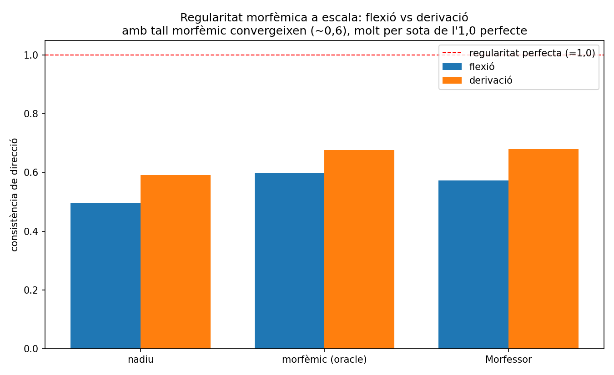
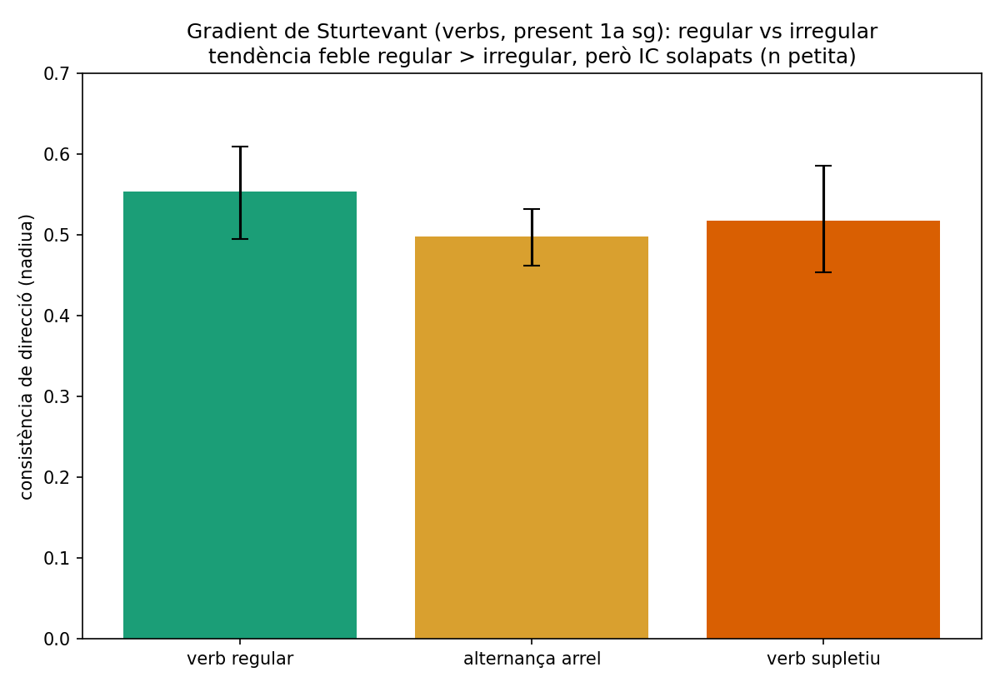
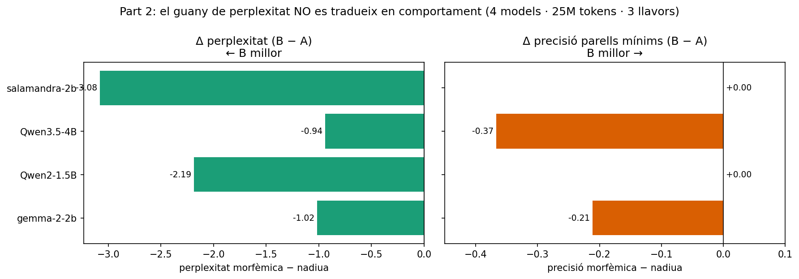

# La morfologia no surt de franc

**Com la tokenització en subparaules fractura la morfologia catalana, i si
una segmentació conscient dels morfemes recupera la geometria de l'espai
latent — provat en tres llengües indoeuropees (català, castellà, anglès).**

Estudi germà de [*Coca Is Not Cocaine*](https://github.com/xaviviro/coca-is-not-cocaine), que reutilitza el mateix panell de
models de pesos oberts però fa una pregunta de tokenització i morfologia:
no *on cau una paraula*, sinó *com el tokenitzador la talla* i què li fa
això a la **geometria composicional** de la morfologia catalana — amb el
sufix adverbial **`-ment`** (`ràpid → ràpida → ràpidament`) com a cas
protagonista.

---

## Resum

Hem mesurat com els tokenitzadors dels grans models de llenguatge tallen la
morfologia catalana, i hem provat si imposar les fronteres morfèmiques
correctes recupera estructura composicional. Nou resultats:

1. **El català es fragmenta molt més que l'anglès.** Als models
   anglo-dominants (Gemma, Qwen, Mistral) una paraula catalana costa **~1,7×**
   més *tokens* que una d'anglesa (fins a **1,9×** a DeepSeek-67B). Els
   tokenitzadors entrenats amb català del **Barcelona Supercomputing Center**
   (Salamandra / ALIA) **redueixen aquest cost a 1,36×**.

2. **Menys fragmentació no vol dir alineació morfèmica.** Cap tokenitzador
   del panell aïlla bé el sufix `-ment` (només ~20% de les vegades). El
   tokenitzador del BSC fragmenta menys perquè manté paraules senceres en un
   sol *token* —però això **amaga la frontera del morfema a dins**, no
   l'exposa.

3. **Una segmentació morfèmica d'origen (oracle) recupera la geometria composicional.** Si
   forcem el tall pels morfemes en temps d'inferència (sense reentrenar), la
   **geometria millora en els cinc models petits** —sobretot en flexió (gènere,
   plural) i en l'analogia de `-ment`. Això suggereix que una tokenització
   conscient dels morfemes exposaria una estructura que els models ja
   codifiquen en part.

4. **El punt volat (`l·l`) és el tret ortogràfic més castigat.** Una paraula
   amb ela geminada (*col·legi*) es parteix en ~4 *tokens* perquè tots dos
   tokenitzadors aïllen el punt volat (`·`) com a token propi; ni tan sols el tokenitzador
   conscient del català ho comprimeix. La `ç` i el dígraf `ny` afegeixen un càstig
   menor.

5. **No cal un oracle.** Un segmentador morfèmic realista i no supervisat
   (Morfessor) gairebé iguala l'oracle en la millora geomètrica, i el guany es
   manté en totes les profunditats de capa. El control placebo (tall aleatori)
   *empitjora* la geometria, confirmant que la millora és específica dels
   morfemes.

6. **La regularitat morfèmica indoeuropea es manté a escala, però és incompleta.**
   Amb el tall morfèmic correcte, la composicionalitat convergeix a ~0,64 (no a
   1,0): la desviació per arbitrarietat històrica és real i mesurable. La
   hipòtesi clàssica "flexió més regular que derivació" **no es confirma**
   geomètricament (si de cas, la derivació és igual o més regular; vegeu
   [`docs/morphology-background.md`](docs/morphology-background.md)).

7. **Patrons indoeuropeus (prefixació, Sturtevant, profunditat).** Els
   **prefixos** són els que més guanyen amb el tall morfèmic (delta +0,198, el
   més gran de l'estudi); el **gradient de Sturtevant** regular→irregular és una
   tendència feble sense gradient net; i la **profunditat derivativa** és una
   evidència en contra (falsador) —l'afix `-ció` sobre base derivada és *més* regular, no
   menys.

8. **El guany és robust.** No depèn de la frase portadora (es replica gairebé
   idèntic sota un marc d'**ús**, Spearman menció~ús = **+0,93**) i **es manté en
   castellà** (rèplica de 6 famílies paral·leles, Spearman CA~ES = **+0,89**): un
   patró estable a través de tres llengües indoeuropees, sense pretensió
   d'universalitat plena.

9. **La geometria millora, però el comportament necessita reentrenar.** Validació
   en tasca: els models ja prefereixen les formes morfològicament correctes amb
   tokenització nadiua (parells mínims, 90%), i un *probe* lineal ja decodifica
   nombre/gènere (~0,9). **Forçar** la segmentació morfèmica a un model ja
   entrenat **empitjora** el comportament (la seqüència li és desconeguda). El
   benefici és **intern**. La **Part 2** ho posa a prova reentrenant amb el
   tokenitzador morfèmic: el reentrenament **baixa la perplexitat als 4 models
   però no millora el comportament** (parells mínims) en cap —una dissociació
   neta.

> Els models del BSC (Salamandra / ALIA) s'inclouen com a control
> conscient del català i es descriuen de manera neutra al llarg de tot l'estudi.

---

## Conclusions pràctiques

> ⚠️ L'estudi és **principalment intrínsec** (mesura geometria de l'espai
> latent). La validació en tasca (findings §14) i la **Part 2** matisen el punt 4:
> el benefici de la segmentació morfèmica és **intern** i **no es trasllada a
> comportament, ni tan sols reentrenant** (la perplexitat baixa, la precisió en
> parells mínims no puja). La resta de punts són **implicacions plausibles**
> (vegeu [`docs/limitations.md`](docs/limitations.md)).

1. **El català surt car de tokenitzar, i això té conseqüències de cost.** Una
   paraula catalana costa ~1,7× més *tokens* que una d'anglesa (fins a ~4× amb
   l'ela geminada `l·l`). En API de pagament per token, latència i context
   efectiu, **els usuaris en català paguen més per menys** — el mateix patró
   d'inequitat que Petrov et al. (2023) i Ahia et al. (2023) documenten entre
   llengües.

2. **Tria el tokenitzador pensant en la llengua, no només en la mida.** Un
   vocabulari conscient del català (BSC Salamandra/ALIA) redueix el cost del
   català ~35% (1,7× → 1,36×). Si despleguies en català, és una palanca directa.

3. **Però "menys *tokens*" no vol dir "millor morfologia".** Cap tokenitzador del
   panell aïlla bé els morfemes (el sufix `-ment` només ~20% de les vegades);
   triar un tokenitzador només per fertilitat baixa **no** garanteix
   representacions morfològicament netes.

4. **Pre-segmentar pels morfemes neteja la geometria, però NO n'hi ha prou
   sense reentrenar.** Forçar el tall morfèmic millora la geometria composicional
   en tots els models (i un segmentador de **regles** català, recall 0,78, ja
   iguala l'oracle). **Però** *afegir* aquesta segmentació a un model ja entrenat
   **empitjora** el comportament en log-probabilitat (la seqüència d'ids li
   resulta desconeguda), i —troballa clau de **Part 2**— **reentrenar amb el
   tokenitzador morfèmic tampoc no millora el comportament**: baixa la
   perplexitat als 4 models, però la precisió en parells mínims no puja en cap.
   El guany morfèmic es queda en geometria i regularitat, no en comportament
   gramatical.

5. **Vigila l'ela geminada (`l·l`) en textos tècnics/acadèmics.** És el cas
   patològic (~4 *tokens* per paraula, i ni els tokenitzadors catalans la
   comprimeixen): textos amb molt `col·legi`, `cèl·lula`, `paral·lel`… inflen el
   pressupost de *tokens* de manera desproporcionada.

6. **El fenomen és estable, no una anècdota catalana.** Es replica en castellà
   (Spearman CA~ES +0,89) i no depèn de la frase de prova (Spearman +0,93): és
   raonable esperar el mateix patró en altres llengües romàniques/indoeuropees
   morfològicament riques.

---

## La fragmentació, en una figura


Quants *tokens* més costa el català que l'anglès, per tokenitzador. El
càstig més gran és per a DeepSeek-67B (1,89×) i Gemma (~1,85×); el més baix,
de bon tros, és el tram català-aware del BSC (1,36×).

### Com els tokenitzadors tallen les paraules catalanes


Les caixes són *tokens*; la línia vermella és la frontera real del morfema.
Gemma (anglo) sobre-fragmenta i gairebé mai talla pel morfema (a
*ràpidament* fa `rà|pid|ament`, i la frontera `ràpida|ment` cau *dins* de
l'últim *token*); Salamandra (BSC) manté la paraula sencera però aleshores
amaga la costura morfèmica dins d'un sol *token*. Cap dels dos aïlla
`-ment`. En canvi, tots dos coincideixen a *gatet* (`gat|et`) i Salamandra
encerta *cantem* (`cant|em`).

### Trets ortogràfics catalans: `l·l`, `ç` i `ny`


El **punt volat (`l·l`) és el cas extrem**: tots dos tokenitzadors aïllen el `·`
com a token propi, així que una paraula amb ela geminada costa ~4–4,6
subparaules (gairebé el doble d'un plural normal), i **ni el tokenitzador
català-aware ho comprimeix**. La `ç` i el dígraf `ny` afegeixen un càstig
menor.

### La mitigació: ajuda una segmentació morfèmica?


Blau = la geometria millora quan forcem la segmentació morfèmica oracle
(empalmant *token ids*, sense reentrenar). El delta és positiu a gairebé
totes les famílies catalanes i als cinc models, més fort en la flexió. Un
asterisc marca les cel·les on l'**IC 95 % per bootstrap** exclou el zero.


Amb només ~40 parells per família, els intervals de confiança temperen la
lectura: el guany d'analogia de Salamandra-2B és clarament significatiu
(+0,33), com també la regressió de Gemma-4-E2B (−0,23); moltes altres cel·les
són positives de mitjana però el seu IC creua el zero.

### Rigor: és específic dels morfemes? (control placebo)


Per descartar que *qualsevol* re-segmentació millori la geometria, comparem la
morfèmica amb una segmentació **aleatòria** (mateix nombre de peces, tall no
morfèmic). En els **cinc models** la morfèmica supera l'aleatòria amb IC 95 %
que exclou el zero — i la segmentació aleatòria *empitjora* la geometria per
sota de la nativa. El guany és **específic dels morfemes**, no de trossejar.
Les significacions per cel·la dels mapes de calor estan corregides per
comparacions múltiples (Benjamini–Hochberg FDR).

### No cal un oracle: un segmentador realista (Morfessor) ja n'hi ha prou



L'oracle és el sostre teòric. Un **Morfessor** no supervisat (que mai veu les
fronteres gold i només n'encerta el ~54 %) **gairebé iguala l'oracle** en
geometria, i el seu guany exclou el zero en els 5 models. La lectura pràctica:
no cal una segmentació perfecta — una de raonable ja exposa la composicionalitat.
L'escala és nítida: nadiu (0,55) → aleatori cau (0,50) → Morfessor (0,63) ≈
**regles català (0,63)** ≈ oracle (0,64). El segmentador de **regles català**
(recall 0,78 vs gold, molt per sobre del 0,54 de Morfessor) és el condicionant
desplegable més fort i iguala l'oracle.

### Robustesa de portadora i rèplica romànica



El guany morfèmic **no depèn de la frase portadora**: re-extret sota una
portadora d'**ús** (en lloc de menció), el delta segueix gairebé idèntic
(Spearman +0,93; els punts cauen sobre la diagonal). I **es replica en castellà**
(6 famílies paral·leles, Spearman CA~ES = +0,89 en consistència nadiua, +0,77 en
el delta morfèmic) — el patró no és una idiosincràsia del català, sinó estable a
través de tres llengües indoeuropees.

### Robustesa entre capes



El guany morfèmic és **positiu a les tres profunditats de capa** en els cinc
models, no és un artefacte de triar una capa concreta.

### Validació en tasca: la geometria millora, el comportament necessita reentrenar



Amb tokenització **nadiua** els models ja prefereixen la forma morfològicament
correcta (parells mínims, 90% de precisió). Però **forçar** la segmentació
morfèmica per empalmament d'ids **enfonsa** la precisió (a 0,18): la seqüència
resultant és *out-of-distribution* per a un model que no s'hi va entrenar. El
benefici de la segmentació morfèmica és, doncs, **intern** (geometria); la
**Part 2** (més avall) prova si reentrenar el captura en comportament —i troba que
**no**: la perplexitat baixa però la precisió en parells mínims no millora.

### Es manté la regularitat del morfema indoeuropeu a escala?



Amb el tall morfèmic, la consistència convergeix a **~0,64** (no a l'1,0
perfecte): la regularitat morfèmica **es manté i és mesurable**, però la
desviació per arbitrarietat històrica (canvi fonètic, gramaticalització,
lexicalització) és real. La hipòtesi "flexió més regular que derivació" **no es
confirma** (si de cas, la derivació és igual o més regular). Fons teòric a
[`docs/morphology-background.md`](docs/morphology-background.md).

### Patrons indoeuropeus: prefixació i gradient de Sturtevant



Tres patrons motivats per la morfologia IE (findings §11): **(A)** els
**prefixos** (`des-`, `re-`, `in-`) tenen el delta morfèmic més gran de tot
l'estudi (+0,198, p=0,001) — omplir el buit sufixal era important; **(B/C)** el
**gradient de Sturtevant** (regular → irregular) és una tendència feble amb IC
solapats, sense gradient net; **(D)** la **profunditat derivativa** és un
falsador: `-ció` sobre base derivada (`globalització`) és *més* regular, no
menys — mana la regularitat del patró, no la profunditat.

### El sufix protagonista: `-ment`


Gris = tokenització nadiua, verd = segmentació morfèmica oracle. La
re-segmentació millora la consistència de direcció en 4 de 5 models i
l'analogia en 4 de 5; el guany més espectacular és l'analogia de
Salamandra-2B (0,625 → 0,950).

---

## Part 2 — reentrenament: el guany és de perplexitat, no de comportament

Part 1 deixa una pregunta oberta. El benefici de la segmentació morfèmica és
**intern** (geometria); imposar-lo per empalmament d'ids sobre un model que no
s'hi va entrenar **enfonsa** el comportament (parells mínims 0,90 → 0,18,
*out-of-distribution*). **Part 2** posa a prova la hipòtesi forta: si
**reentrenem** amb segmentació morfèmica, el guany geomètric es converteix en
guany de comportament?

**Disseny.** *Continued-pretraining* controlat A/B sobre **25M tokens** del corpus
català `projecte-aina/CATalog`: **4 models** del panell × **3 llavors** (42/43/44)
× 2 condicions = **24 entrenaments**. **A** = tokenització nadiua (control); **B** =
segmentació morfèmica per regles (`scripts/rule_seg.py`), empalmada amb el mateix
vocabulari. A i B són idèntics en tota la resta (corpus, passos, *learning rate*,
llavor); l'única variable és la segmentació. (`gemma-4-E2B` queda exclòs: és
numèricament inestable amb els optimitzadors disponibles en bf16 —error de
*kernel* amb bitsandbytes i divergència silenciosa amb Adafactor.)



### Perplexitat: B guanya, als 4 models

| model | A nadiu | B morfèmic | Δ (B − A) |
| --- | ---: | ---: | ---: |
| gemma-2-2b | 9,58 | 8,56 | **−1,02** |
| Qwen2-1.5B | 11,93 | 9,74 | **−2,19** |
| Qwen3.5-4B | 8,72 | 7,78 | **−0,94** |
| salamandra-2b | 11,14 | 8,05 | **−3,09** |

4 de 4 models, 12 de 12 llavors: la perplexitat de retenció baixa amb B, amb
variància entre llavors menyspreable (std < 0,04). El tokenitzador català-aware
(salamandra) és el que més baixa.

### Comportament (parells mínims): B no guanya en cap model

| model | acc A nadiu | acc B morfèmic | Δ (B − A) |
| --- | ---: | ---: | ---: |
| gemma-2-2b | 0,99 | 0,78 | **−0,21** |
| Qwen2-1.5B | 0,967 | 0,967 | 0,00 |
| Qwen3.5-4B | 1,000 | 0,633 | **−0,37** |
| salamandra-2b | 1,000 | 1,000 | 0,00 |

Cap dels 4 models mostra B > A: dos empaten (al sostre) i dos es **degraden**
clarament.

### Conclusió: una dissociació neta

> El guany de perplexitat de la segmentació morfèmica **no es tradueix en
> comportament gramatical** —i en la meitat dels models l'empitjora.

La perplexitat més baixa de B reflecteix **regularitat**, no comprensió: després
d'una arrel, el morfema (`-ment`) és gairebé determinista, i una seqüència
morfèmica és intrínsecament més predictible per token. Quan es mesura la tasca
neta —triar la frase gramatical, sobre les mateixes frases, cada model sota la
seva pròpia segmentació— el reentrenament morfèmic no aporta benefici. **La
hipòtesi forta (la geometria de Part 1 → comportament) no se sosté.**

**Matís honest:** la condició nadiua A ja parteix del sostre (0,97–1,00) en aquests
parells mínims, cosa que deixa poc marge perquè B la superi. Però la degradació de
B en gemma-2-2b (−0,21) i Qwen3.5-4B (−0,37) és real i no atribuïble al sostre:
l'empalmament morfèmic per ids encara perjudica, sobretot el model gran —
consistent amb la troballa de Part 1 que aquest tall és *out-of-distribution*.

**Implicació per a la visió (Part 3).** El disseny preveia que una Part 2 nul·la en
comportament falsa de manera barata la ruta morfèmica cap a l'equitat entre
llengües indoeuropees. L'empalmament ingenu de peces de subparaula no és el camí;
un tokenitzador *genuïnament* morfèmic (no per ids) seria una recerca diferent.

**Pesos i reproducció.** Els 24 models reentrenats són a Hugging Face, cadascun amb
la seva *model card* en català i les corbes d'entrenament:
`huggingface.co/xaviviro/morfo-part2-{model}-{A|B}-s{42,43,44}`. Codi a `part2/`,
resultats a `part2/out/part2_results.csv` i corbes A vs B per model a
`part2/out/figs/`.

---

## Què hem fet

- **RQ1 — Auditoria del tokenitzador (els 11 tokenitzadors del panell, sense
  GPU):** fertilitat (subparaules/paraula) català vs anglès, i *recall* de
  frontera morfèmica.
- **RQ2 — Geometria (5 models petits, GPU):** és lineal el subespai
  morfològic? La "direcció `-ment`" `v(adverbi) − v(adjectiu)` com a vector
  consistent, a la manera de Bolukbasi et al. (2016).
- **RQ3 — Mitigació (contrafactual, sense reentrenar):** imposem una
  segmentació morfèmica oracle per empalmament de *token ids* i tornem a
  mesurar la geometria.

## El lèxic

Lèxic curat a mà (`data/morph_pairs.csv`, **517 parells** base→derivat, **27
famílies** en tres llengües IE (ca/es/en), llicència CC-BY), revisat per l'autor (accents, la regla del femení
per a `-ment`, formes irregulars):

| grup | famílies | morfologia |
| --- | --- | --- |
| derivació CA | `ment`, `dim_et`, `agent_dor`, `nom_cio` | adverbial -ment, diminutiu -et, agentiu -dor, nominalitzador -ció |
| flexió CA | `plural`, `verb_em`, `gender_a` | plural -s/-os, 1a pl. -em, gènere -a |
| ortografia CA | `gem_lla`, `cedilla`, `ny` | plural amb ela geminada l·l, ç, dígraf ny |
| prefixació CA | `pre_des`, `pre_re`, `pre_in` | prefixos des-, re-, in-/im- |
| gradient verbal CA | `verb_reg`, `verb_alt`, `verb_supl` | regular → alternança d'arrel → suppletiu (1a sg present) |
| profunditat CA | `nom_cio_d1` | -ció sobre base ja derivada (globalitzar→globalització) |
| rèplica ES | `es_mente`, `es_cion`, `es_dor`, `es_dim`, `es_plural`, `es_genero_a` | 6 famílies castellanes paral·leles (segona llengua romànica) |
| *baseline* EN | `ly`, `agent_er`, `nom_tion`, `plural_s` | adverbi -ly, agentiu -er, -tion, plural -s |

La taula completa amb el detall de cada família és a
[`docs/methodology.md`](docs/methodology.md) §2.

## El panell de models

L'auditoria de tokenitzadors cobreix els 11 models de l'estudi *coca*. La
geometria de l'espai vectorial corre sobre el tram petit (cap en una GPU de
16 GB a bf16):

| tram | models |
| --- | --- |
| geometria + auditoria | `gemma-2-2b`, `gemma-4-E2B`, `Qwen2-1.5B`, `Qwen3.5-4B-Base`, **`BSC-LT/salamandra-2b`** |
| només auditoria | `gemma-4-26B-A4B`, `Mistral-Small-24B`, `Qwen3.6-35B-A3B`, `deepseek-llm-67b-base`, `BSC-LT/salamandra-7b`, `BSC-LT/ALIA-40b` |

`salamandra-2b` és el control català-aware: un model amb un tokenitzador
entrenat amb una proporció no trivial de català.

## Documentació

| vols… | llegeix |
| --- | --- |
| el mètode (RQ, mecanisme d'empalmament, mètriques) | [`docs/methodology.md`](docs/methodology.md) |
| els resultats + xifres | [`docs/findings.md`](docs/findings.md) |
| què **no** afirma l'estudi | [`docs/limitations.md`](docs/limitations.md) |
| com regenerar-ho tot | [`docs/reproduce.md`](docs/reproduce.md) |
| rerefons morfològic (regularitat IE vs arbitrarietat) | [`docs/morphology-background.md`](docs/morphology-background.md) |
| treball relacionat i referències | [`docs/references.md`](docs/references.md) |

> Tota la documentació (README, `docs/`) i el text dels gràfics són en català.

## Inici ràpid

```bash
uv sync
uv run pytest -q
uv run python scripts/m01_build_lexicon.py
uv run python scripts/m02_tokenize_audit.py
for M in google/gemma-2-2b google/gemma-4-E2B Qwen/Qwen2-1.5B Qwen/Qwen3.5-4B-Base BSC-LT/salamandra-2b; do
  uv run python scripts/m03_extract.py --model "$M"
done
uv run python scripts/m04_geometry.py
uv run python scripts/m05_figs.py
uv run python scripts/m06_figs.py
```

## Llicència

Codi: MIT. El lèxic curat a mà (`data/morph_pairs.csv`) és CC-BY 4.0 —
citeu-lo si el reutilitzeu.

## Autors

Xavier Vinaixa Roselló — Sorensen AI ([sorensen.ai](https://sorensen.ai)),
Barcelona · [ORCID 0009-0005-2769-9215](https://orcid.org/0009-0005-2769-9215)
· [github.com/xaviviro](https://github.com/xaviviro) ·
[xavi@sorensen.ai](mailto:xavi@sorensen.ai)

Marçal Font Espí

## Citació

```bibtex
@misc{vinaixa2026morfologia,
  title        = {La morfologia no surt de franc: com la tokenitzaci\'o en
                  subparaules fractura la morfologia catalana},
  author       = {Vinaixa Rosell\'o, Xavier and Font Esp\'i, Mar\c{c}al},
  year         = {2026},
  institution  = {Sorensen AI, Barcelona},
  note         = {ORCID: 0009-0005-2769-9215},
  url          = {https://github.com/xaviviro/la-morfologia-no-surt-de-franc}
}
```

Hi ha un `CITATION.cff` a l'arrel del repositori perquè les eines que
consumeixen el Citation File Format el llegeixin directament (GitHub en
genera un botó «Cite this repository»).
